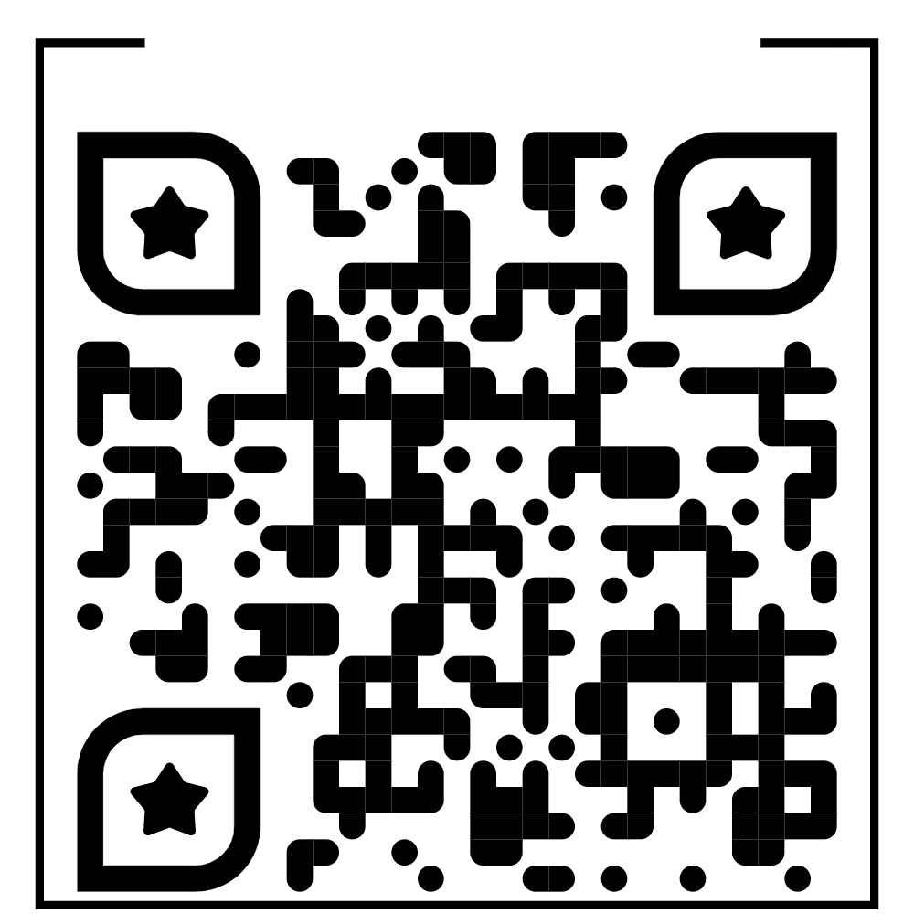
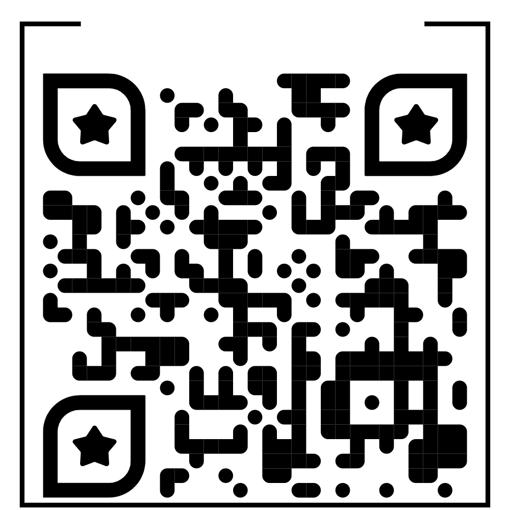

# Vitasium: AI-Driven Clinical Intelligence ⚡🩺⚡

<p align="center">
  
  
  
  
</p>

Vitasium is a high-fidelity **Retrieval-Augmented Generation (RAG)** ecosystem designed to combat health misinformation. Developed for the **Hack Appster 2026** hackathon, it delivers curated medical information via WhatsApp and a Web Dashboard by grounding AI responses in verified clinical literature. 💡🏥

---

## 🌟 The Innovation (Hack Appster Criteria)
While standard AI bots hallucinate medical advice, Vitasium uses a **multi-layered validation stack**:
- **Social Impact:** Democratizing access to quality healthcare information for 50+ language speakers.
- **Innovation:** Real-time emergency detection that triggers localized emergency links (112).
- **Scalability:** Built on a serverless architecture (Pinecone + Groq) capable of handling thousands of concurrent users across two distinct platforms.

### Core Features
* **Verified Knowledge** 💪: Grounded in *Oxford Handbook of Clinical Medicine*, *IFRC First Aid Guidelines*, and *Gale Encyclopedia of Medicine*.
* **Multilingual Parity** 🆕: Seamless communication in 50+ languages (English, Tamil, Hindi, Spanish, Japanese, Chinese, etc.).
* **Emergency Triage** 📁: Instant detection of life-threatening symptoms with automated 112-link triggers.
* **Contextual Memory** 📁: AI remembers your medical history throughout the session for personalized care.

---

## 📲 How to Interact with Vitasium

### I. WhatsApp Assistant (Twilio)
**Option A: Scan & Join (Fastest)**
1. Scan the **Vitasium_bot_QR** below.
2. Send the default message already typed in your chat.
3. Upon confirmation, send **"Hi"** or **"Hello"** to begin.

<p align="center">
  
</p>

**Option B: Manual Join**
1. Save **+1 415 523 8886** to your contacts.
2. Send the message `join practical-more`.
3. Type **"Hi"** or **"Hello"** to begin.

---

### II. Clinical Dashboard (Web App)
**Option A: Mobile Scan**
1. Scan the **Vitasium_dashboard_QR** below.
2. **Crucial:** Switch your mobile browser to **"Desktop Site"** mode.
3. Begin exploring.

<p align="center">
  
</p>

**Option B: Direct Link**
1. [**Launch Vitasium Web App**](https://vitasium-dashboard.onrender.com)
2. **Crucial:** Switch your mobile browser to **"Desktop Site"** mode.
3. Begin exploring.

---

## 🛠️ Technical Architecture & Scalability

| Layer | Component | Description |
| :--- | :--- | :--- |
| **Intelligence** | Llama-3.3-70B | High-speed reasoning via Groq LPU inference engine. |
| **Knowledge** | Pinecone Serverless | Vector database for sub-second clinical context retrieval. |
| **Embeddings** | Gemini-Embedding-001 | High-dimensional semantic mapping of medical context. |
| **Deployment** | Flask & Streamlit | Dual-channel interface hosted on Render. |


## 📁 Project Structure 

```text
Vitasium_Project/
├── app.py                # Streamlit Dashboard UI
├── whatsapp_bot.py       # Flask Server (WhatsApp Integration)
├── vitasium_engine.py    # Core RAG Logic & AI Inference
├── .streamlit/           # Production config for Render
│   └── config.toml       # Port and Headless settings
├── requirements.txt      # Project Dependencies
└── .gitignore            # Security: Keeps .env and cache hidden
```

## ⚖️ Safety & Disclaimer

**Vitasium is an educational health awareness tool.** It is **not** a substitute for professional medical advice, diagnosis, or treatment. The system includes hard-coded emergency overrides that trigger when life-threatening symptoms are detected, directing users to immediate professional care.

## ⚡Plans for the future 
1. **Voice-to-Text:** Allow illiterate users to send WhatsApp voice notes for triage. 🎙️
2. **Vision RAG:** Integration with Gemini Vision for analyzing skin rashes or prescriptions. 📸